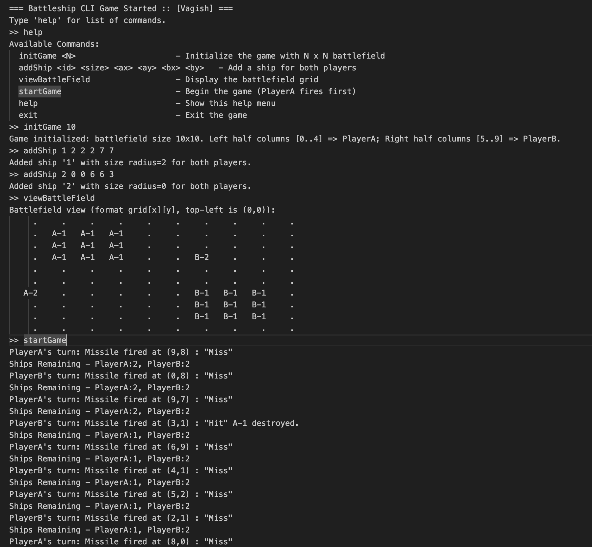
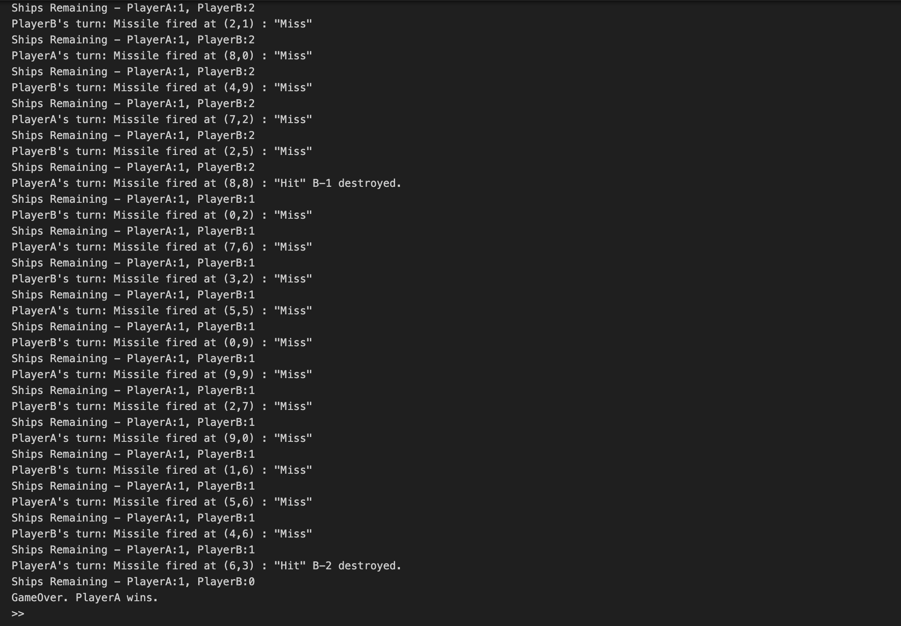

# 🛳️ Battleship Game (Java CLI)

A **two-player Battleship Game** implemented in **Java** with a **Command-Line Interface (CLI)** and **JUnit 5 test coverage**.  
The game follows object-oriented design and simulates a battle between Player A and Player B, where each player places ships and fires missiles at random coordinates until one wins.

---

## 📋 Features

- ⚙️ Fully object-oriented design
- 🎮 CLI-based interactive gameplay
- 💣 Randomized missile firing (no repeats)
- 🧱 Ships placed on an NxN battlefield
- 🧭 Equal fleet for both players
- 🧩 Validations for overlap, bounds, and halves
- 🧪 JUnit 5 test coverage
- ✅ Gradle-based project setup

---

## 🚀 Quick Start

### 1️⃣ Clone or Download

```bash
git clone https://github.com/vagishyagnik/BattleShip.git
cd BattleShipGame
```

### 1️ Build the Project

```bash
./gradlew build
```

### 2 Run the Game

```bash
./gradlew run
```

# 🎮 Battleship Game - Gameplay Instructions

Once the game starts in the Command-Line Interface (CLI), you can use the following commands to play:

---

## 📝 Available Commands

| Command | Description |
|---------|-------------|
| `initGame <N>` | Initialize the game with an **N x N** battlefield grid. <br>Example: `initGame 5` |
| `addShip <id> <size> <ax> <ay> <bx> <by>` | Add a ship for both players with given coordinates. <br>Example: `addShip S1 3 0 0 0 2` |
| `viewBattleField` | Display the current battlefield grid. |
| `startGame` | Start the battle. Player A fires the first missile. |
| `help` | Show the list of available commands. |
| `exit` | Exit the game. |

---

## 🕹️ Example Gameplay Session

| 
| 

